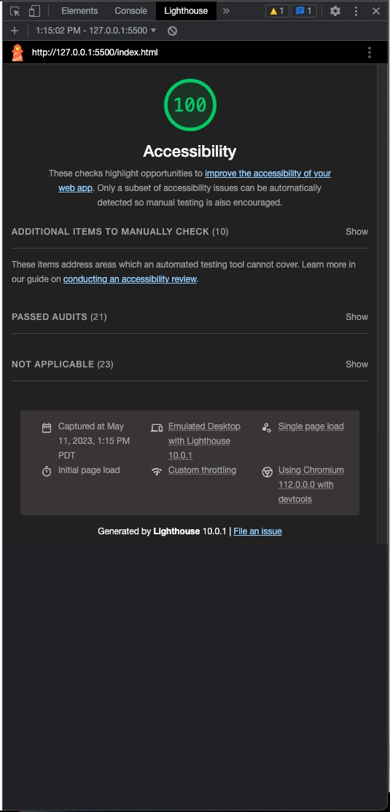

# Salmon Cookies Lab for Code 201 at Code Fellows

## Salmon Cookies

This lab builds a frontend homepage for a salmon cookies company with randomly generated data per the requirements of the lab.  This homepage additionally links to a sales page which gives detailed sales numbers for each location.

### Author: Aaron Clark

### Links and Resources

* formatting help taken from video: https://www.youtube.com/watch?v=52sKmRsk7xU
* ChartJS for charting library and supporting documentation
* Google Maps API for location widget

### Lighthouse Accessibility Report Score

* 
